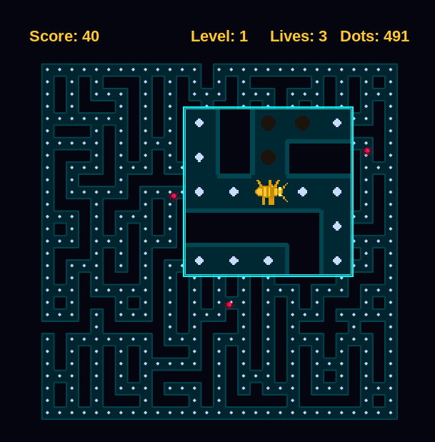

# Mega-Bug

A modern reimagining of the 1982 classic **Mega-Bug**. Navigate a cockroach through a maze, eat dots, and avoid spiders!



## Features

- **Animated cockroach player** with 6 legs and antennae that scurry when moving
- **Spiders (bugs)** with smart AI that chase, flank, and ambush
- **Magnifying lens** gives a zoomed-in view of the action around the player
- **Difficulty scaling**: More spiders, faster speeds, and smarter AI each level
- **Procedural audio**: Satisfying chomps when eating, scary warning tones when spiders enter view
- **Progressive maze clearing**: Track your visited path through the maze

## Requirements

- Python 3.10+
- Pygame (CE version recommended)

## Installation

### Linux

1. **Clone the repository:**
   ```bash
   git clone https://github.com/crenedecotret/mega-bug.git
   cd mega-bug
   ```

2. **Create a virtual environment (optional but recommended):**
   ```bash
   python3 -m venv venv
   source venv/bin/activate
   ```

3. **Install dependencies:**
   ```bash
   pip install pygame-ce numpy
   ```

   Or if you prefer the standard pygame:
   ```bash
   pip install pygame numpy
   ```

4. **Run the game:**
   ```bash
   python -m src.main
   ```

### Windows

Yes, the game runs on Windows! The process is similar:

1. **Clone or download the repository**

2. **Create a virtual environment:**
   ```cmd
   python -m venv venv
   venv\Scripts\activate
   ```

3. **Install dependencies:**
   ```cmd
   pip install pygame-ce numpy
   ```

4. **Run the game:**
   ```cmd
   python -m src.main
   ```

## Controls

| Key | Action |
|-----|--------|
| **Arrow Keys** or **WASD** | Move the cockroach |
| **Space** or **P** | Pause / unpause |
| **F11** | Toggle fullscreen |
| **ESC** | Return to menu (or quit from menu) |

## Scoring

| Event | Points |
|-------|--------|
| Eat a dot | **+10** |
| Clear a level | **+100 × level number** |

Level bonuses scale up: clearing level 1 earns 100 pts, level 2 earns 200 pts, level 5 earns 500 pts, etc. Your final score is shown on the Game Over screen.

## How to Play

1. **Eat all dots** to clear the level
2. **Avoid spiders** — they appear in your magnifying lens and will chase you!
3. **Listen for the warning sound** — it plays when a spider enters your lens view
4. **Clear levels** to advance — each level adds more spiders and makes them faster/smarter
5. **Don't die** — you have 3 lives. Respawn away from spiders when hit

## Game Mechanics

- **Visited trail**: The amber trail shows where you've been
- **Magnifying lens**: The square lens in the center shows a zoomed view around your cockroach
- **Spider AI**: Four personalities — Chaser (direct), Ambusher (predicts your path), Flanker (cuts you off), and Heater (follows your heat trail)
- **Difficulty progression**: Level 1 starts with 3 spiders, adding one per level

## Project Structure

```
mega-bug/
├── src/
│   ├── main.py       # Entry point, game loop, states
│   ├── engine.py     # Maze generation, pathfinding, heat map
│   ├── entities.py   # Player and Bug classes
│   ├── renderer.py   # Rendering, lens, drawing
│   ├── audio.py      # Procedural sound synthesis
│   └── settings.py   # Configuration constants
└── README.md
```

## Credits

- Original game: **Mega-Bug** (1982) — designed by **Steve Bjork**, published by **Datasoft Inc.**, licensed to **Tandy Corporation**
- This reimagined version: Modernized with pygame, featuring procedural graphics and audio

## License

MIT License — Feel free to use, modify, and distribute!
